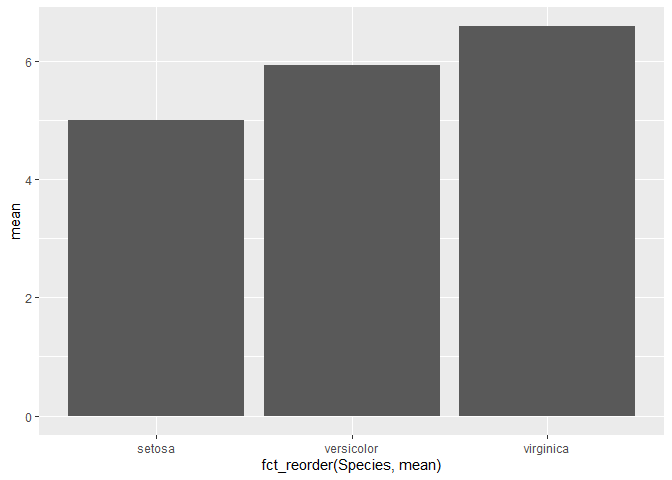

Rmd Test
================
Cody Tuttle
11/2/2020

``` r
library(tidyverse)
```

    ## -- Attaching packages --------------------------------------- tidyverse 1.3.0 --

    ## v ggplot2 3.3.2     v purrr   0.3.4
    ## v tibble  3.0.4     v dplyr   1.0.2
    ## v tidyr   1.1.2     v stringr 1.4.0
    ## v readr   1.4.0     v forcats 0.5.0

    ## -- Conflicts ------------------------------------------ tidyverse_conflicts() --
    ## x dplyr::filter() masks stats::filter()
    ## x dplyr::lag()    masks stats::lag()

``` r
data(iris)
```

``` r
iris %>% 
  group_by(Species) %>% 
  summarise(mean = mean(Sepal.Length, na.rm = T)) %>% 
  ggplot(aes(x = fct_reorder(Species, mean), y = mean)) +
  geom_col()
```

    ## `summarise()` ungrouping output (override with `.groups` argument)

<!-- -->
