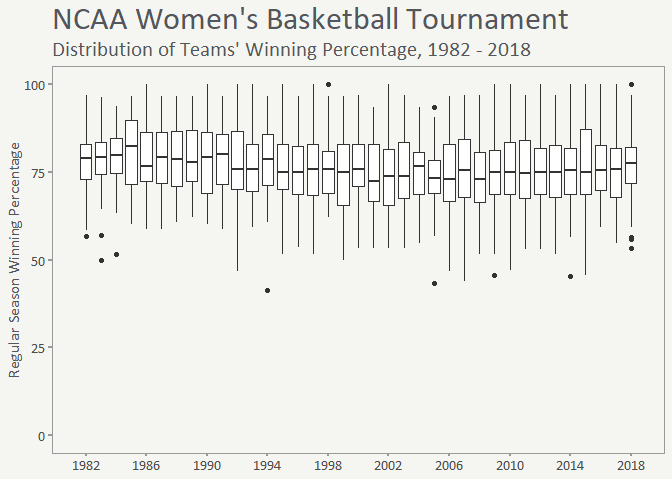
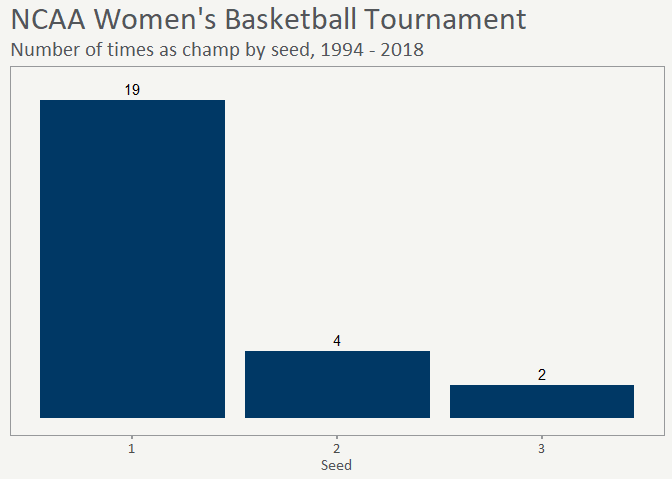
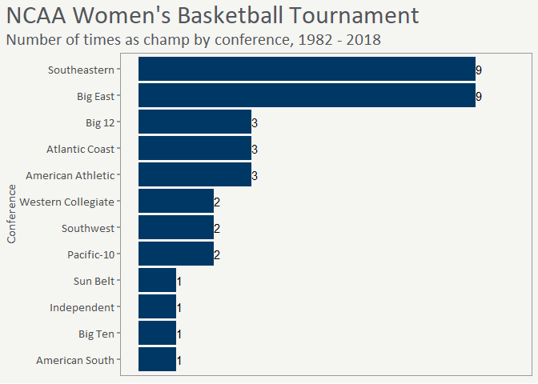

```r
# load packages

library(tidyverse)
library(lubridate)
library(mmbtools)
library(janitor)
library(readr)
library(readxl)
library(openxlsx)
library(writexl)
library(tidytuesdayR)
library (gt)

mmb_load_fonts()
```


```r
# read in data

tourn <- readr::read_csv('https://raw.githubusercontent.com/rfordatascience/tidytuesday/master/data/2020/2020-10-06/tournament.csv')
```


```r
# table of one seeds

one_seeds <- tourn %>% 
  mutate(champ = ifelse(tourney_finish == "Champ", 1, 0)) %>%
  filter(year >= 1994,
         seed == 1) %>% 
  group_by(school) %>%
  summarize(
    years_as_one_seed = n(), 
    ever_champ = max(champ), 
    avg_win_pct = mean(reg_percent, na.rm = T)
  ) %>%
  mutate(ever_champ = ifelse(ever_champ == 1, "Yes", "No")) %>%
  arrange(desc(years_as_one_seed)) %>%
  top_n(10, years_as_one_seed) %>% 
  gt_mmb() %>%
  cols_label(
    school = "School", 
    years_as_one_seed = "Times as #1 Seed", 
    ever_champ = "Ever Tournament Champion?", 
    avg_win_pct = "Average Winning Pct."
  ) %>%
  tab_header(
    title = "NCAA Women's Basketball Tournament #1 Seeds", 
    subtitle = "1994 - 2018"
  ) %>%
  cols_align(
    columns = 2:3, align = "right"
  ) %>%
  fmt_number(
    columns = 4,
    decimals = 2
  ) %>%
  cols_move_to_end(columns = vars(ever_champ)) %>%
  tab_footnote(
    footnote = "In years that school was a #1 seed", 
    locations = cells_column_labels(
      columns = vars(avg_win_pct, ever_champ)
    )
  )

one_seeds
```

<!--html_preserve--><style>html {
  font-family: Calibri;
}

#gwycyrmqyu .gt_table {
  display: table;
  border-collapse: collapse;
  margin-left: auto;
  margin-right: auto;
  color: #333333;
  font-size: 16px;
  font-weight: normal;
  font-style: normal;
  background-color: #f5f5f2;
  width: auto;
  border-top-style: solid;
  border-top-width: 2px;
  border-top-color: #A8A8A8;
  border-right-style: none;
  border-right-width: 2px;
  border-right-color: #D3D3D3;
  border-bottom-style: solid;
  border-bottom-width: 2px;
  border-bottom-color: #A8A8A8;
  border-left-style: none;
  border-left-width: 2px;
  border-left-color: #D3D3D3;
}

#gwycyrmqyu .gt_heading {
  background-color: #003865;
  text-align: center;
  border-bottom-color: #f5f5f2;
  border-left-style: none;
  border-left-width: 1px;
  border-left-color: #D3D3D3;
  border-right-style: none;
  border-right-width: 1px;
  border-right-color: #D3D3D3;
}

#gwycyrmqyu .gt_title {
  color: #FFFFFF;
  font-size: 125%;
  font-weight: initial;
  padding-top: 4px;
  padding-bottom: 4px;
  border-bottom-color: #f5f5f2;
  border-bottom-width: 0;
}

#gwycyrmqyu .gt_subtitle {
  color: #FFFFFF;
  font-size: 85%;
  font-weight: initial;
  padding-top: 0;
  padding-bottom: 4px;
  border-top-color: #f5f5f2;
  border-top-width: 0;
}

#gwycyrmqyu .gt_bottom_border {
  border-bottom-style: solid;
  border-bottom-width: 2px;
  border-bottom-color: #D3D3D3;
}

#gwycyrmqyu .gt_col_headings {
  border-top-style: solid;
  border-top-width: 2px;
  border-top-color: #D3D3D3;
  border-bottom-style: solid;
  border-bottom-width: 2px;
  border-bottom-color: #D3D3D3;
  border-left-style: none;
  border-left-width: 1px;
  border-left-color: #D3D3D3;
  border-right-style: none;
  border-right-width: 1px;
  border-right-color: #D3D3D3;
}

#gwycyrmqyu .gt_col_heading {
  color: #333333;
  background-color: #f5f5f2;
  font-size: 100%;
  font-weight: bold;
  text-transform: inherit;
  border-left-style: none;
  border-left-width: 1px;
  border-left-color: #D3D3D3;
  border-right-style: none;
  border-right-width: 1px;
  border-right-color: #D3D3D3;
  vertical-align: bottom;
  padding-top: 5px;
  padding-bottom: 6px;
  padding-left: 5px;
  padding-right: 5px;
  overflow-x: hidden;
}

#gwycyrmqyu .gt_column_spanner_outer {
  color: #333333;
  background-color: #f5f5f2;
  font-size: 100%;
  font-weight: bold;
  text-transform: inherit;
  padding-top: 0;
  padding-bottom: 0;
  padding-left: 4px;
  padding-right: 4px;
}

#gwycyrmqyu .gt_column_spanner_outer:first-child {
  padding-left: 0;
}

#gwycyrmqyu .gt_column_spanner_outer:last-child {
  padding-right: 0;
}

#gwycyrmqyu .gt_column_spanner {
  border-bottom-style: solid;
  border-bottom-width: 2px;
  border-bottom-color: #D3D3D3;
  vertical-align: bottom;
  padding-top: 5px;
  padding-bottom: 6px;
  overflow-x: hidden;
  display: inline-block;
  width: 100%;
}

#gwycyrmqyu .gt_group_heading {
  padding: 8px;
  color: #333333;
  background-color: #f5f5f2;
  font-size: 100%;
  font-weight: bold;
  text-transform: inherit;
  border-top-style: solid;
  border-top-width: 2px;
  border-top-color: #D3D3D3;
  border-bottom-style: solid;
  border-bottom-width: 2px;
  border-bottom-color: #D3D3D3;
  border-left-style: none;
  border-left-width: 1px;
  border-left-color: #D3D3D3;
  border-right-style: none;
  border-right-width: 1px;
  border-right-color: #D3D3D3;
  vertical-align: middle;
}

#gwycyrmqyu .gt_empty_group_heading {
  padding: 0.5px;
  color: #333333;
  background-color: #f5f5f2;
  font-size: 100%;
  font-weight: bold;
  border-top-style: solid;
  border-top-width: 2px;
  border-top-color: #D3D3D3;
  border-bottom-style: solid;
  border-bottom-width: 2px;
  border-bottom-color: #D3D3D3;
  vertical-align: middle;
}

#gwycyrmqyu .gt_from_md > :first-child {
  margin-top: 0;
}

#gwycyrmqyu .gt_from_md > :last-child {
  margin-bottom: 0;
}

#gwycyrmqyu .gt_row {
  padding-top: 8px;
  padding-bottom: 8px;
  padding-left: 5px;
  padding-right: 5px;
  margin: 10px;
  border-top-style: solid;
  border-top-width: 1px;
  border-top-color: #D3D3D3;
  border-left-style: none;
  border-left-width: 1px;
  border-left-color: #D3D3D3;
  border-right-style: none;
  border-right-width: 1px;
  border-right-color: #D3D3D3;
  vertical-align: middle;
  overflow-x: hidden;
}

#gwycyrmqyu .gt_stub {
  color: #333333;
  background-color: #f5f5f2;
  font-size: 100%;
  font-weight: initial;
  text-transform: inherit;
  border-right-style: solid;
  border-right-width: 2px;
  border-right-color: #D3D3D3;
  padding-left: 12px;
}

#gwycyrmqyu .gt_summary_row {
  color: #333333;
  background-color: #f5f5f2;
  text-transform: inherit;
  padding-top: 8px;
  padding-bottom: 8px;
  padding-left: 5px;
  padding-right: 5px;
}

#gwycyrmqyu .gt_first_summary_row {
  padding-top: 8px;
  padding-bottom: 8px;
  padding-left: 5px;
  padding-right: 5px;
  border-top-style: solid;
  border-top-width: 2px;
  border-top-color: #D3D3D3;
}

#gwycyrmqyu .gt_grand_summary_row {
  color: #333333;
  background-color: #f5f5f2;
  text-transform: inherit;
  padding-top: 8px;
  padding-bottom: 8px;
  padding-left: 5px;
  padding-right: 5px;
}

#gwycyrmqyu .gt_first_grand_summary_row {
  padding-top: 8px;
  padding-bottom: 8px;
  padding-left: 5px;
  padding-right: 5px;
  border-top-style: double;
  border-top-width: 6px;
  border-top-color: #D3D3D3;
}

#gwycyrmqyu .gt_striped {
  background-color: rgba(128, 128, 128, 0.05);
}

#gwycyrmqyu .gt_table_body {
  border-top-style: solid;
  border-top-width: 2px;
  border-top-color: #D3D3D3;
  border-bottom-style: solid;
  border-bottom-width: 2px;
  border-bottom-color: #D3D3D3;
}

#gwycyrmqyu .gt_footnotes {
  color: #333333;
  background-color: #e6ecf0;
  border-bottom-style: none;
  border-bottom-width: 2px;
  border-bottom-color: #D3D3D3;
  border-left-style: none;
  border-left-width: 2px;
  border-left-color: #D3D3D3;
  border-right-style: none;
  border-right-width: 2px;
  border-right-color: #D3D3D3;
}

#gwycyrmqyu .gt_footnote {
  margin: 0px;
  font-size: 90%;
  padding: 4px;
}

#gwycyrmqyu .gt_sourcenotes {
  color: #333333;
  background-color: #f5f5f2;
  border-bottom-style: none;
  border-bottom-width: 2px;
  border-bottom-color: #D3D3D3;
  border-left-style: none;
  border-left-width: 2px;
  border-left-color: #D3D3D3;
  border-right-style: none;
  border-right-width: 2px;
  border-right-color: #D3D3D3;
}

#gwycyrmqyu .gt_sourcenote {
  font-size: 90%;
  padding: 4px;
}

#gwycyrmqyu .gt_left {
  text-align: left;
}

#gwycyrmqyu .gt_center {
  text-align: center;
}

#gwycyrmqyu .gt_right {
  text-align: right;
  font-variant-numeric: tabular-nums;
}

#gwycyrmqyu .gt_font_normal {
  font-weight: normal;
}

#gwycyrmqyu .gt_font_bold {
  font-weight: bold;
}

#gwycyrmqyu .gt_font_italic {
  font-style: italic;
}

#gwycyrmqyu .gt_super {
  font-size: 65%;
}

#gwycyrmqyu .gt_footnote_marks {
  font-style: italic;
  font-size: 65%;
}
</style>
<div id="gwycyrmqyu" style="overflow-x:auto;overflow-y:auto;width:auto;height:auto;"><table class="gt_table">
  <thead class="gt_header">
    <tr>
      <th colspan="4" class="gt_heading gt_title gt_font_normal" style>NCAA Women's Basketball Tournament #1 Seeds</th>
    </tr>
    <tr>
      <th colspan="4" class="gt_heading gt_subtitle gt_font_normal gt_bottom_border" style>1994 - 2018</th>
    </tr>
  </thead>
  <thead class="gt_col_headings">
    <tr>
      <th class="gt_col_heading gt_columns_bottom_border gt_left" rowspan="1" colspan="1">School</th>
      <th class="gt_col_heading gt_columns_bottom_border gt_right" rowspan="1" colspan="1">Times as #1 Seed</th>
      <th class="gt_col_heading gt_columns_bottom_border gt_right" rowspan="1" colspan="1">Average Winning Pct.<sup class="gt_footnote_marks">1</sup></th>
      <th class="gt_col_heading gt_columns_bottom_border gt_right" rowspan="1" colspan="1">Ever Tournament Champion?<sup class="gt_footnote_marks">1</sup></th>
    </tr>
  </thead>
  <tbody class="gt_table_body">
    <tr>
      <td class="gt_row gt_left">UConn</td>
      <td class="gt_row gt_right">21</td>
      <td class="gt_row gt_right">95.98</td>
      <td class="gt_row gt_right">Yes</td>
    </tr>
    <tr>
      <td class="gt_row gt_left">Tennessee</td>
      <td class="gt_row gt_right">15</td>
      <td class="gt_row gt_right">89.85</td>
      <td class="gt_row gt_right">Yes</td>
    </tr>
    <tr>
      <td class="gt_row gt_left">Notre Dame</td>
      <td class="gt_row gt_right">8</td>
      <td class="gt_row gt_right">94.17</td>
      <td class="gt_row gt_right">Yes</td>
    </tr>
    <tr>
      <td class="gt_row gt_left">Stanford</td>
      <td class="gt_row gt_right">8</td>
      <td class="gt_row gt_right">92.75</td>
      <td class="gt_row gt_right">No</td>
    </tr>
    <tr>
      <td class="gt_row gt_left">Duke</td>
      <td class="gt_row gt_right">7</td>
      <td class="gt_row gt_right">91.09</td>
      <td class="gt_row gt_right">No</td>
    </tr>
    <tr>
      <td class="gt_row gt_left">Baylor</td>
      <td class="gt_row gt_right">5</td>
      <td class="gt_row gt_right">95.78</td>
      <td class="gt_row gt_right">Yes</td>
    </tr>
    <tr>
      <td class="gt_row gt_left">North Carolina</td>
      <td class="gt_row gt_right">5</td>
      <td class="gt_row gt_right">92.40</td>
      <td class="gt_row gt_right">No</td>
    </tr>
    <tr>
      <td class="gt_row gt_left">South Carolina</td>
      <td class="gt_row gt_right">4</td>
      <td class="gt_row gt_right">91.22</td>
      <td class="gt_row gt_right">Yes</td>
    </tr>
    <tr>
      <td class="gt_row gt_left">Louisiana Tech</td>
      <td class="gt_row gt_right">3</td>
      <td class="gt_row gt_right">94.27</td>
      <td class="gt_row gt_right">No</td>
    </tr>
    <tr>
      <td class="gt_row gt_left">LSU</td>
      <td class="gt_row gt_right">3</td>
      <td class="gt_row gt_right">91.17</td>
      <td class="gt_row gt_right">No</td>
    </tr>
    <tr>
      <td class="gt_row gt_left">Maryland</td>
      <td class="gt_row gt_right">3</td>
      <td class="gt_row gt_right">90.73</td>
      <td class="gt_row gt_right">No</td>
    </tr>
  </tbody>
  
  <tfoot>
    <tr class="gt_footnotes">
      <td colspan="4">
        <p class="gt_footnote">
          <sup class="gt_footnote_marks">
            <em>1</em>
          </sup>
           
          In years that school was a #1 seed
          <br />
        </p>
      </td>
    </tr>
  </tfoot>
</table></div><!--/html_preserve-->


```r
# boxplot of winning percentages by year

tourn %>%
  ggplot() +
  geom_boxplot(aes(x = year, y = reg_percent, group = year)) +
  ylab("Regular Season Winning Percentage") +
  ggtitle("NCAA Women's Basketball Tournament", 
          subtitle = "Distribution of Teams' Winning Percentage, 1982 - 2018") +
  expand_limits(x = c(1982, 2018), y = c(0, 100)) +
  scale_x_continuous(breaks = seq(1982, 2018, 4)) +
  theme_mmb_basic(axis.title.y = element_text(size = 12),
                  axis.title.x = element_blank())
```

<!-- -->


```r
# graph of the number of tourney wins by each seed 

seed_champs <- tourn %>% 
  filter(year >= 1994, 
         tourney_finish == "Champ") %>% 
  group_by(seed) %>%
  count() %>%
  ggplot(aes(x = seed, y = n)) +
  geom_col(fill = mncolors["minnesota_blue"]) +
  expand_limits(y = c(0,20)) +
  geom_text(aes(label = n), vjust = -0.5, size = 4) +
  xlab("Seed") +
  ggtitle("NCAA Women's Basketball Tournament", 
          subtitle = "Number of times as champ by seed, 1994 - 2018") +
  theme_mmb_basic(axis.title.y = element_blank(),
                  axis.text.y = element_blank(), 
                  axis.ticks.y = element_blank(),
                  axis.title.x = element_text(size = 12))
  
  
seed_champs
```

<!-- -->


```r
# graph of the number of tourney wins by each conf 

conf_champs <- tourn %>% 
  filter(tourney_finish == "Champ") %>% 
  group_by(conference) %>%
  count() %>%
  ggplot(aes(x = fct_reorder(conference, n), y = n)) +
  geom_col(fill = mncolors["minnesota_blue"]) +
  expand_limits(y = c(0,10)) +
  geom_text(aes(label = n), hjust = "left", size = 4) +
  xlab("Conference") +
  ylab("Times as Champ") +
  ggtitle("NCAA Women's Basketball Tournament", 
          subtitle = "Number of times as champ by conference, 1982 - 2018") +
  coord_flip() +
  theme_mmb_basic(plot.title.position = "plot",
                  axis.title.x = element_blank(),
                  axis.text.x = element_blank(), 
                  axis.ticks.x = element_blank(), 
                  axis.title.y = element_text(size = 12))
  
  
conf_champs
```

<!-- -->

